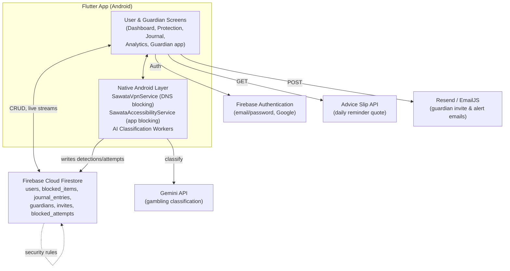
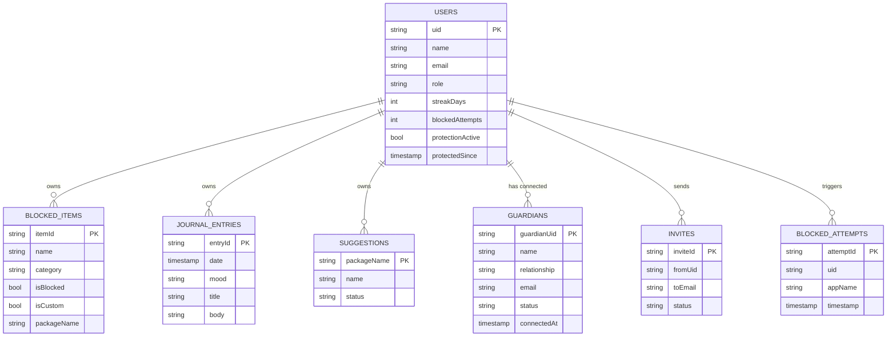

# Sawatâ: A Smart Gambling Blocker for Recovery

*Advanced Mobile Programming — Midterm Project*

## Description

Sawatâ is a Flutter/Android mobile application that helps people in gambling
recovery avoid relapse by blocking gambling websites and apps at the device
level, tracking recovery progress, and connecting each user with a trusted
"Guardian" contact who can monitor that progress remotely. Website blocking
runs through a local on-device VPN that filters DNS lookups against a
blocklist; app blocking runs through an Accessibility Service that detects
and closes flagged apps as they're opened. All user data (blocked items,
journal entries, guardian relationships, recovery stats) is stored per-account
in Firebase Cloud Firestore, protected by ownership-scoped security rules.

## Project Objectives

- Block access to known gambling websites and apps in real time, without
  requiring the user to configure anything manually.
- Automatically flag newly opened apps/domains that look gambling-related
  (keyword matching + AI classification) and let the user confirm whether to
  block them.
- Give users a private space (journal) to record their mood and reflections
  during recovery.
- Let a user invite a trusted "Guardian" who can view recovery progress
  (streaks, blocked attempts, alerts) without being able to disable
  protection themselves.
- Keep all of the above backed by real, per-user cloud storage (Firebase
  Authentication + Firestore) instead of local/in-memory state, so progress
  survives reinstalls and is visible across devices.

## Scope and Limitations

**In scope (implemented):**
- Android only — website blocking (local VPN) and app blocking
  (Accessibility Service) are native Android features with no iOS
  equivalent implemented.
- Email/password and Google sign-in via Firebase Authentication.
- Full CRUD on blocked sites/apps and journal entries, backed by Firestore.
- Guardian invite → accept flow, with the relationship persisted in
  Firestore and enforced by Firestore security rules.
- On-device keyword matching plus an AI classifier (Gemini, via a background
  Worker) that flags likely-gambling apps/domains for the user to confirm.
- Transactional email (guardian invites, security alerts) via Resend/EmailJS,
  with client-side rate limiting and retry.

**Current limitations (not yet done):**
- The Guardian-side screens (Guardian Dashboard, Alerts, Reports, Settings)
  still render from the original in-memory `AppStore` sample data — they are
  not yet wired up to a real Guardian's actual connected user(s) in
  Firestore. This is the single biggest gap before the Guardian app is
  functionally real.
- On the User Dashboard, the headline stats (streak, blocked attempts) are
  real (Firestore), but the weekly sparkline/history chart still comes from
  seeded data — a weekly-rollup aggregation job hasn't been built yet.
- No iOS build target.
- No automated widget/integration tests yet — only unit tests for the email
  rate-limiter/retry/template logic exist.
- The "Advanced filters" button on the Guardian Alerts screen is a stub
  (shows a "coming soon" message).
- Journal entry deletion has no confirmation dialog (swipe-to-delete only).

## System Architecture



## Database Design (Firestore Schema)

Firestore is a document database, not relational — the diagram below shows
collections/subcollections and the field each document holds, which serves
as this project's schema/ERD equivalent.



Global, non-per-user collections: `blocked_packages` / `blocked_domains`
(admin-curated default blocklist), `app_config` (gambling keyword list),
`ai_candidates` (AI-flagged items pending review), `email_logs` (send log
used for rate limiting).

## Project Progress Report

**Current accomplishments:**
- Firebase Authentication (email/password + Google Sign-In) with role
  selection (User / Guardian).
- Full CRUD for blocked sites/apps and journal entries against Firestore,
  with live snapshot streams so the UI updates in real time.
- Firestore security rules enforcing per-user data ownership.
- Native Android DNS-level website blocking (local VPN) and
  Accessibility-Service-based app blocking.
- AI-assisted gambling detection for newly opened apps/domains, surfaced to
  the user as a confirm/dismiss suggestion.
- Guardian invite-and-accept flow, with transactional email delivery
  (Resend/EmailJS), client-side rate limiting, and retry logic.
- Search/filter on the Blocked Sites & Apps and Journal screens.
- Analytics screen with real blocked-attempt data and charts.

**Remaining for the final project:**
- Wire the Guardian-side screens (Dashboard, Alerts, Reports, Settings) to
  the real connected user's Firestore data instead of sample data.
- Build the weekly-rollup aggregation that the Dashboard's history chart
  needs, replacing the seeded values.
- Implement the "Advanced filters" flow on Guardian Alerts.
- Add a confirmation step to journal entry deletion.
- Add automated widget/integration test coverage beyond the existing email
  utility unit tests.
- Formal API documentation.

## Getting Started

This project uses Flutter with Firebase (Authentication, Cloud Firestore,
Cloud Messaging). See `firebase.json` / `firestore.rules` for the backend
configuration.

```
flutter pub get
flutter run
```
